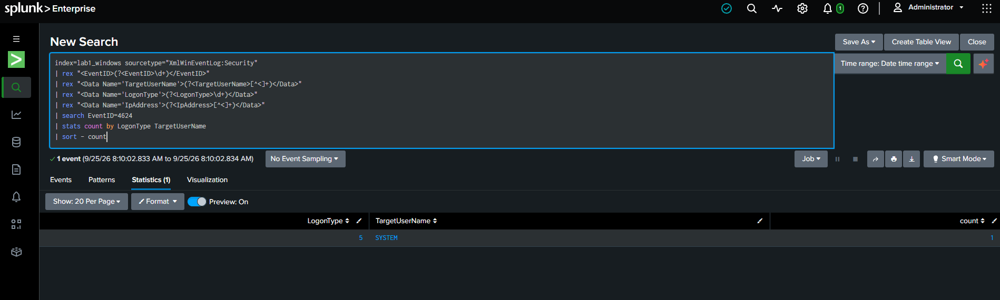
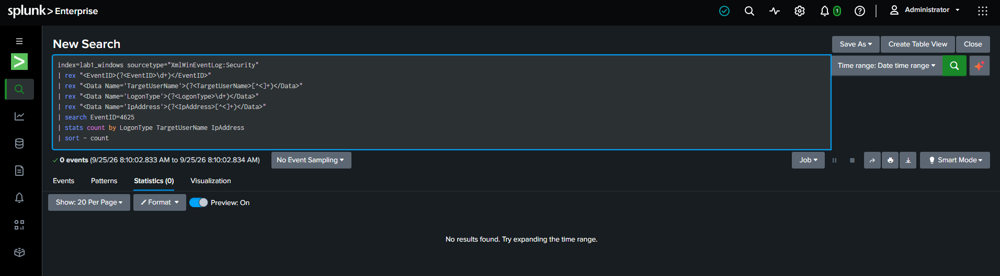

# Baseline Authentication

This section establishes the normal authentication telemetry observed before generating the attack scenarios.

The purpose of the baseline is to provide a reference point for distinguishing expected authentication activity from the events generated during the lab.

## Successful Authentication Baseline

The baseline query identified a successful authentication event with:

- Event ID `4624`
- Logon Type `5`
- Target account `SYSTEM`

Logon Type 5 represents a service logon. This event provides an example of normal authentication-related telemetry present on the workstation.

## Failed Authentication Baseline

No Event ID `4625` events were present during the baseline check.

This establishes that the later failed-authentication events were generated by the controlled attack scenarios rather than being pre-existing activity in the selected baseline period.

## Analyst Relevance

A baseline helps an L1 analyst answer:

1. What authentication activity normally exists?
2. Are failed logons already occurring before the investigation?
3. Which accounts and logon types are normally observed?
4. Does the activity observed during an alert represent a meaningful change?

The baseline is therefore part of the investigation context rather than simply a configuration check.
