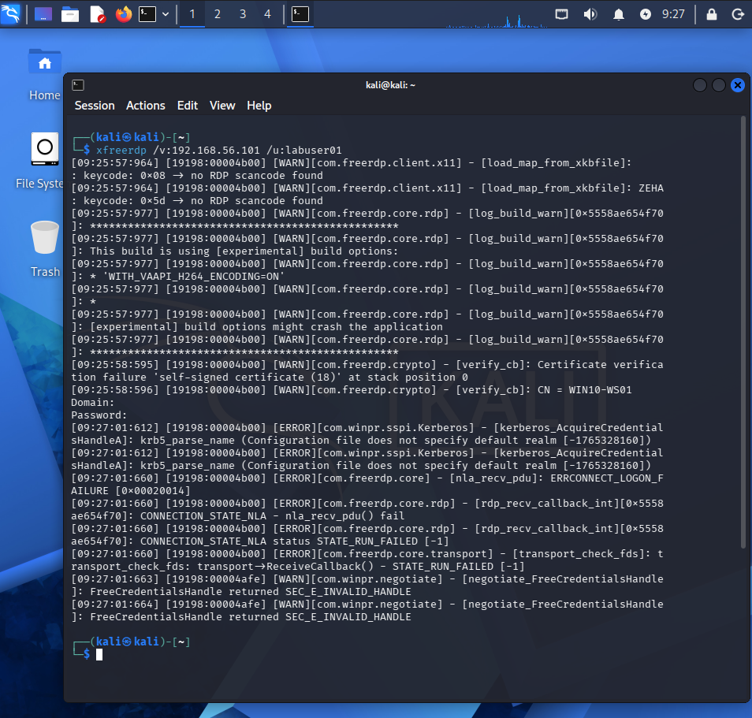
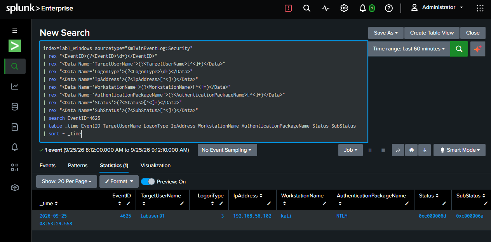
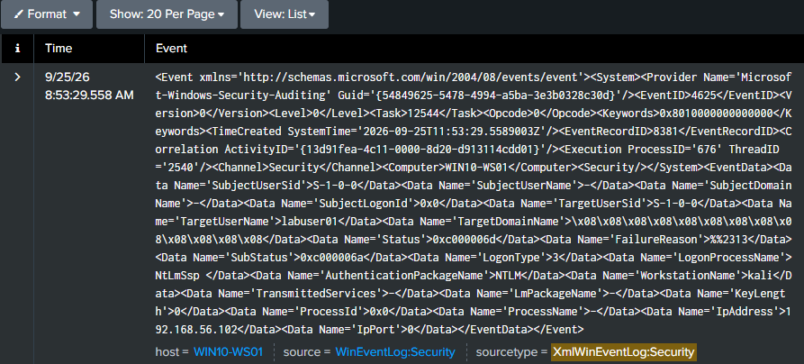

# Failed Authentication

This section documents the first controlled authentication attack: a failed RDP authentication attempt against `WIN10-WS01`.

## Attack Source



The authentication attempt originated from the Kali attacker system:

```text
Source IP: 192.168.56.102
Target: WIN10-WS01
Target account: labuser01
```

The authentication request was generated using FreeRDP against the Windows workstation.

## Event ID 4625



The Windows Security log recorded Event ID `4625`, indicating that the logon attempt failed.

Relevant fields observed in the event include:

| Field | Observed value |
|---|---|
| Event ID | `4625` |
| TargetUserName | `labuser01` |
| Logon Type | `3` |
| IpAddress | `192.168.56.102` |
| WorkstationName | `kali` |
| LogonProcessName | `NtLmSsp` |
| AuthenticationPackageName | `NTLM` |
| Status | `0xc000006d` |
| SubStatus | `0xc000006a` |

The `SubStatus` value `0xc000006a` indicates an incorrect password in this controlled scenario.

## Raw Event Evidence



The raw Windows event provides the underlying evidence from which the investigation fields were extracted.

This is important in SOC work because normalized fields are useful for searching, but the original event should be consulted when additional context or validation is required.

## Analyst Relevance

A single Event ID `4625` is not automatically malicious. An L1 analyst should correlate:

- Source IP
- Target account
- Number of failures
- Time range
- Logon type
- Authentication mechanism
- Whether successful authentication follows
- Whether the source is expected

In this lab, the event becomes more significant when correlated with the repeated attempts documented in the following scenarios.
