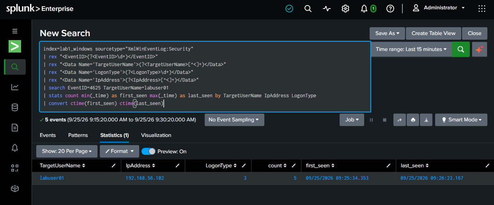
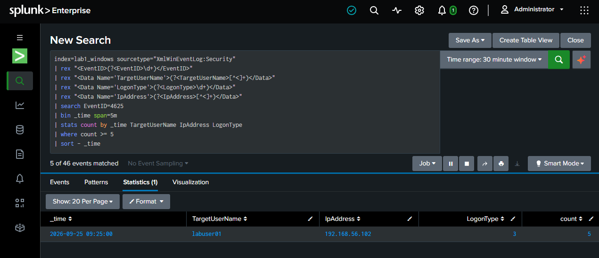

# Brute-Force Authentication

This section documents repeated failed authentication attempts against the same account.

## Repeated Authentication Activity



The controlled scenario generated five failed authentication attempts against:

```text
Target account: labuser01
Source IP: 192.168.56.102
Logon Type: 3
```

The attempts occurred within approximately one minute.

This pattern is consistent with repeated password guessing against a single account.

## Detection Query



The detection logic groups Event ID `4625` events into five-minute windows by:

- Target account
- Source IP
- Logon Type

The relevant threshold is:

```text
count >= 5
```

This identifies a source generating at least five failed authentication attempts against the same account within a five-minute window.

## Analyst Interpretation

The important distinction from a single failed logon is the repeated pattern.

An L1 analyst should validate:

- Whether the source IP is expected
- Whether the same account is repeatedly targeted
- Whether multiple accounts are also being targeted
- Whether the activity is followed by a successful authentication
- Whether there is additional endpoint or network telemetry

The threshold is a detection aid, not proof of malicious activity. Legitimate users, administrators, services, or misconfigured applications can also generate repeated authentication failures.
