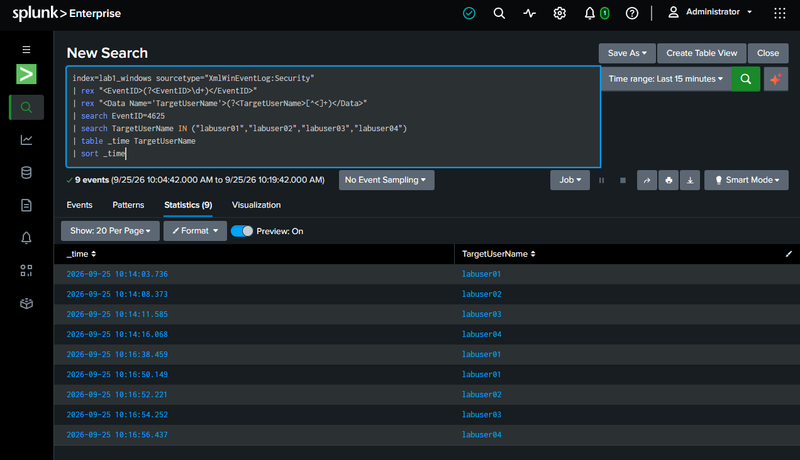
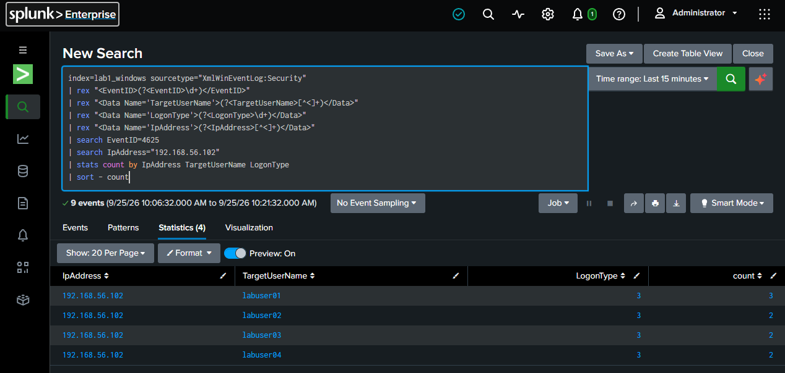
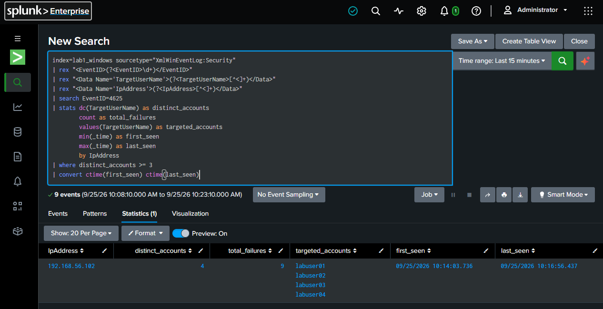

# Password Spraying

This section documents authentication failures distributed across multiple accounts from the same source.

## Authentication Timeline



The controlled scenario generated failed authentication attempts against multiple lab accounts from the same Kali source:

```text
Source IP: 192.168.56.102
Target accounts: labuser01, labuser02, labuser03, labuser04
```

The observed activity occurred between:

```text
First seen: 09/25/2026 10:14:03.736
Last seen:  09/25/2026 10:16:56.437
```

A total of `9` failed authentication events were observed across `4` distinct accounts.

## Account Distribution



The account distribution demonstrates the key behavioral difference between password spraying and a simple brute-force pattern.

Instead of repeatedly targeting one account, the source attempts authentication against multiple accounts.

The affected accounts were:

- `labuser01`
- `labuser02`
- `labuser03`
- `labuser04`

## Detection Query



The detection groups Event ID `4625` events by source IP and calculates:

- `dc(TargetUserName)` — number of distinct targeted accounts
- `count` — total failed authentication events
- `values(TargetUserName)` — accounts targeted by the source
- `min(_time)` — first observed event
- `max(_time)` — last observed event

The detection condition used in the lab was:

```text
distinct_accounts >= 3
```

This focuses on the distribution of failures across accounts rather than relying only on a high failure count for one account.

## Analyst Interpretation

Password spraying is important because a threshold based only on repeated failures against a single account can miss distributed authentication attempts.

An L1 analyst should investigate:

- Source IP
- Number of distinct accounts
- Total failures
- Time range
- Whether the source is expected
- Whether any authentication subsequently succeeds
- Whether the targeted accounts belong to privileged users
- Whether endpoint or network telemetry shows follow-on activity

The detection is intentionally simple and demonstrates the underlying behavioral logic. In a production environment, thresholds and exclusions would need to be tuned to the organization's normal authentication patterns.

## Detection Limitation

A low-and-slow password spray can remain below a fixed threshold. Additional correlation and longer observation windows may therefore be required in a production detection strategy.
