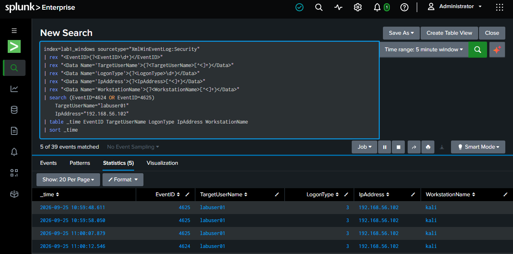

# Failed-to-Successful Authentication

This section documents the correlation of failed authentication attempts followed by a successful authentication from the same source against the same account.

## Observed Sequence



The controlled sequence showed:

```text
4625  10:59:48
4625  10:59:58
4625  11:00:07.879
4624  11:00:12.546
```

The successful authentication occurred approximately five seconds after the final failed attempt.

The events were associated with:

```text
Target account: labuser01
Source IP: 192.168.56.102
Logon Type: 3
Workstation: kali
```

## Investigation Significance

A successful authentication following repeated failures provides important correlation context.

The individual events have different meanings:

- `4625` — failed logon
- `4624` — successful logon

The sequence is more informative than examining either event in isolation.

An L1 analyst should determine:

1. Whether the source is expected.
2. Which account was successfully authenticated.
3. How many failures preceded the success.
4. How quickly the success followed the failures.
5. Whether the account is privileged or sensitive.
6. Whether additional endpoint or network activity follows the successful authentication.

## Important Logon-Type Observation

The RDP/NLA authentication activity observed in this lab produced Logon Type `3` events.

This lab therefore does not use a simplistic assumption that RDP authentication will always appear as Logon Type `10`. Logon type interpretation should be based on the actual telemetry and authentication flow observed.

## Investigation Outcome

The successful authentication was correlated with the preceding failed attempts because the source IP and target account matched.

This correlation demonstrates a common SOC investigation pattern:

```text
Repeated failures
      ↓
Same source + same account
      ↓
Successful authentication
      ↓
Investigate potential account compromise
```

The correlation itself does not prove compromise. It establishes a higher-value investigation lead that should be validated with additional context.
