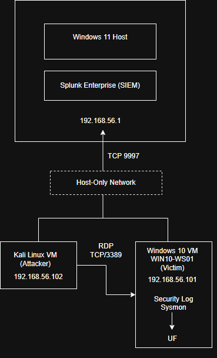
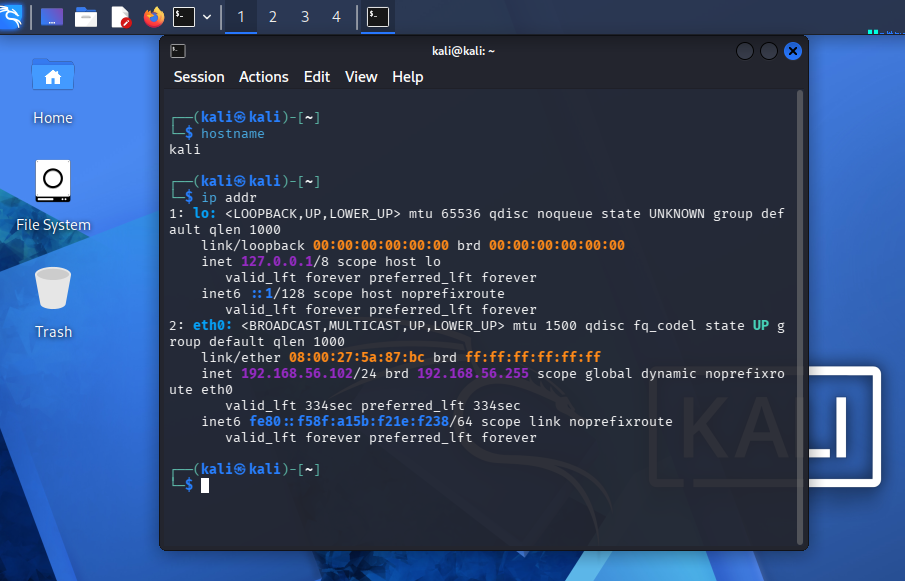
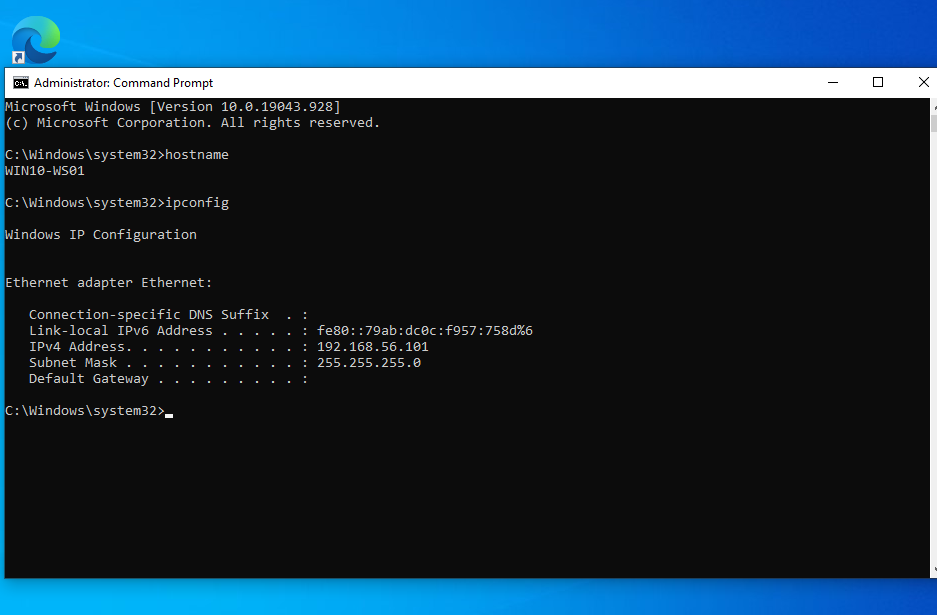

# Lab 1 Architecture

This directory documents the isolated lab architecture used for the Windows authentication attack scenarios.

## Network Topology



The lab uses an isolated VirtualBox Host-Only network for attack traffic and telemetry collection.

### Components

| Component | Role | Address |
|---|---|---|
| Kali Linux | Attacker system | `192.168.56.102` |
| WIN10-WS01 | Windows victim/workstation | `192.168.56.101` |
| Windows 11 host | Splunk Enterprise / telemetry collector | `192.168.56.1` |
| Splunk Universal Forwarder | Forwards Windows telemetry | Runs on `WIN10-WS01` |

### Telemetry Flow

```text
Kali Linux
192.168.56.102
     |
     | RDP / authentication traffic
     | TCP/3389
     v
WIN10-WS01
192.168.56.101
     |
     | Windows Security Events
     | Sysmon Events
     v
Splunk Universal Forwarder
     |
     | TCP/9997
     v
Windows 11 Host
192.168.56.1
     |
     v
Splunk Enterprise
index=lab1_windows
```

The architecture separates the attacker, victim, and SIEM collection path while keeping the lab traffic isolated from the normal network.

## Host Identification

### Kali Linux



The Kali system acts as the attacker and generated the authentication activity used throughout the lab.

### WIN10-WS01



`WIN10-WS01` is the monitored Windows workstation. Windows Security logs and Sysmon telemetry are forwarded to Splunk from this system.

## Telemetry Configuration

The Windows Universal Forwarder collects:

- Windows Security events from `WinEventLog:Security`
- Sysmon Operational events from `Microsoft-Windows-Sysmon/Operational`

Both telemetry sources are sent to the dedicated Splunk index:

```text
lab1_windows
```

The forwarding destination is the Windows 11 host on TCP port `9997`.

## Security-Relevant Design

The architecture supports the investigation of:

- Failed authentication
- Repeated authentication attempts
- Password spraying across multiple accounts
- Successful authentication following failures
- Source IP and target-account correlation
- Endpoint process telemetry through Sysmon

Credentials and local Splunk secrets are intentionally excluded from the repository.
